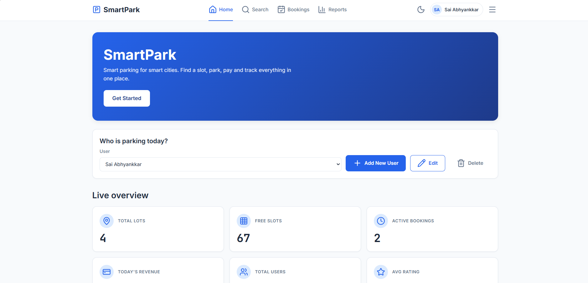
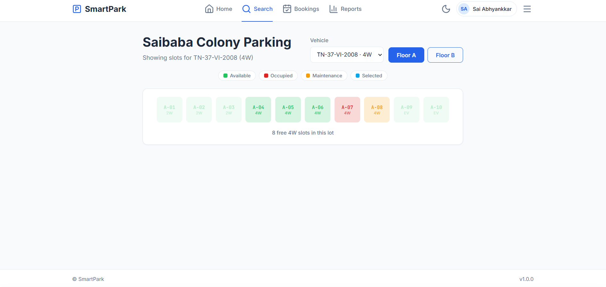
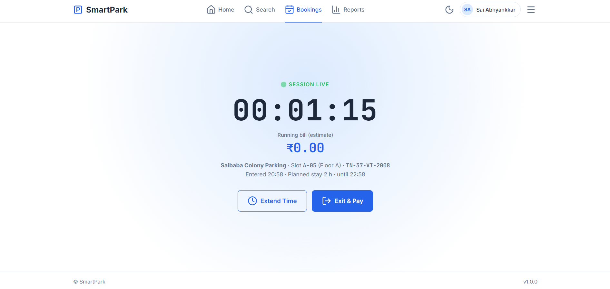
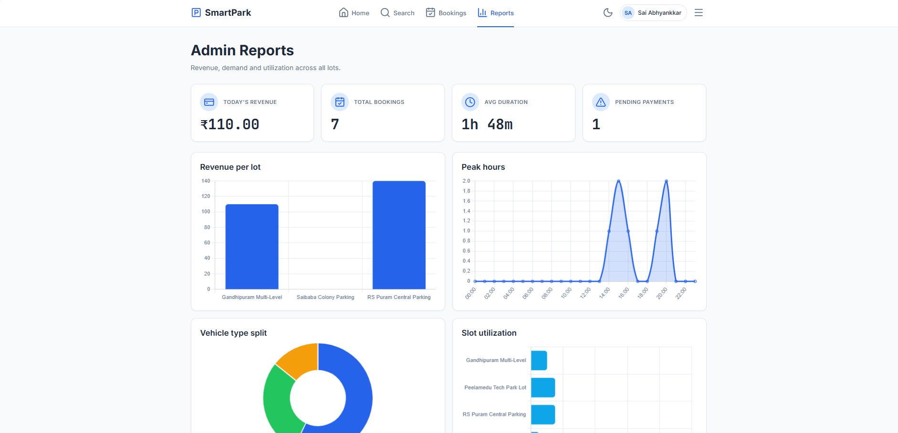
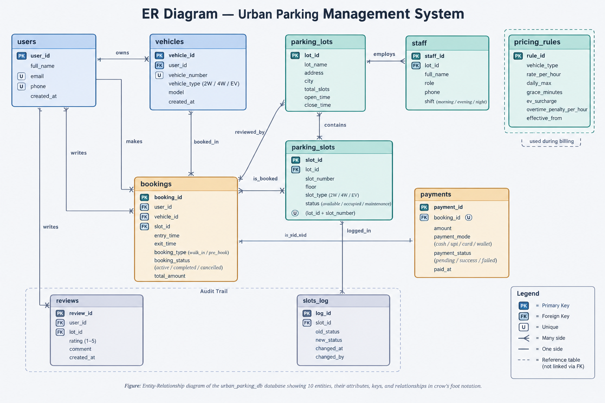
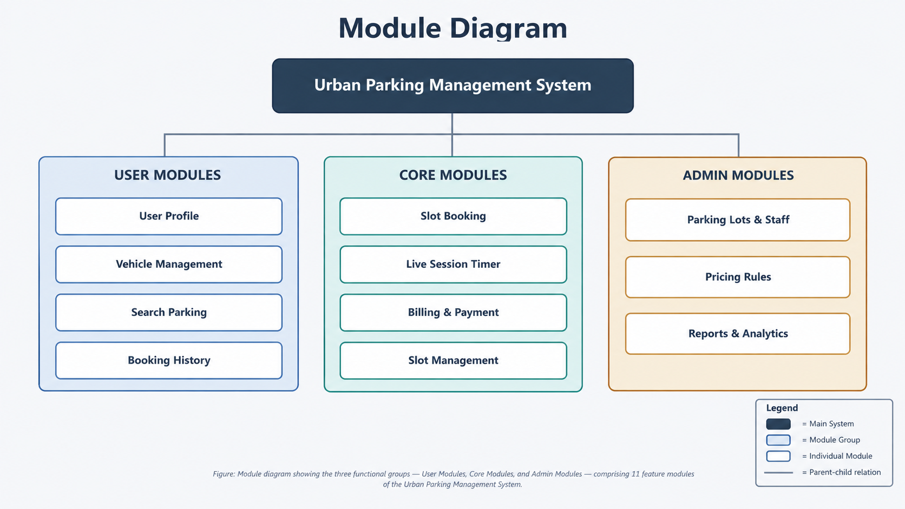

# SmartPark — Urban Parking Management System

A modern, full-stack parking management platform for smart cities, built with PostgreSQL, Flask, and vanilla JavaScript.


---

## Overview

SmartPark is a GUI-based database application that manages the complete lifecycle of urban parking — from user and vehicle registration, through lot discovery, slot booking, live session tracking, automatic billing, and payments, all the way to admin analytics.

It is built on a clean three-tier architecture:

- Frontend — HTML, CSS, vanilla JavaScript (light and dark themes)
- Backend — Python Flask with a JSON REST API and psycopg2
- Database — PostgreSQL with 10 related tables, triggers, views, indexes, and stored functions

The same frontend runs in two modes: as a fully self-contained demo on GitHub Pages (using built-in sample data), and locally against the real Flask and PostgreSQL stack.

---

## Live Demo

https://vipin280720081157-08.github.io/urban-parking-management-system/

No installation is needed. The hosted version runs entirely in your browser with sample data.

Tip: Append `?mode=mock` or `?mode=real` to any page URL to force a mode. The choice is remembered in your browser.

---

## Screenshots

### Dashboard


### Interactive Slot Map


### Live Session Timer


### Admin Reports and Analytics


All screenshots live in `report/screenshots/`.

---

## Features

| Category | Highlights |
|----------|-----------|
| User Management | Add, view, edit, delete users and their vehicles |
| Smart Search | Filter lots by city, vehicle type, duration, and time |
| Visual Slot Map | Colour-coded grid (available, occupied, maintenance, selected) |
| Booking | Walk-in or pre-book; atomic booking via a database function |
| Live Session | Real-time HH:MM:SS timer with running bill estimate |
| Auto Billing | Trigger computes duration, grace, daily max, overtime, EV surcharge |
| Payments | Cash, UPI, Card, Wallet — recorded per booking |
| Reviews | Rate lots; average rating updates live on the search page |
| Analytics | Revenue, peak hours, vehicle split, utilization, top users |
| Dark Mode | Persistent light and dark theme across all pages |
| Responsive | Works on mobile, tablet, and desktop |

---

## Architecture

```
+--------------+   JSON    +--------------+    SQL    +--------------+
|  FRONTEND    | --------> |   BACKEND    | --------> |   DATABASE   |
|  HTML/CSS/JS | <-------- | Flask +      | <-------- | PostgreSQL   |
|  fetch()     |           | psycopg2     |           | 10 tables    |
+--------------+           +--------------+           +--------------+
```

- Presentation layer — 9 HTML pages, single stylesheet, modular JavaScript
- Logic layer — Flask blueprints, REST endpoints, server-side validation
- Data layer — normalized schema, indexes, views, triggers, stored functions

### Block Diagrams

ER Diagram — 10 entities with keys and relationships



Module Diagram — 3 module groups, 11 features



---

## Database Design

Database name: `urban_parking_db`

| # | Table | Purpose |
|---|-------|---------|
| 1 | users | Registered drivers |
| 2 | vehicles | Vehicles owned by users |
| 3 | parking_lots | Parking facilities |
| 4 | parking_slots | Individual slots per lot |
| 5 | staff | Attendants and managers |
| 6 | pricing_rules | Rate card per vehicle type |
| 7 | bookings | Parking sessions (entry to exit) |
| 8 | payments | Payment records |
| 9 | reviews | User ratings per lot |
| 10 | slots_log | Audit trail of slot status changes |

Advanced DBMS features used:

- 7 indexes on high-traffic query paths
- 4 views: `v_available_slots`, `v_active_bookings`, `v_revenue_summary`, `v_slot_utilization`
- 3 triggers: auto-billing on exit, slot-status audit log, double-booking prevention
- 3 stored functions: `fn_book_slot`, `fn_exit_and_bill`, `fn_generate_daily_report`
- Full referential integrity with `ON DELETE` rules and `CHECK` constraints
- Window functions (`LAG`) and aggregates for reporting

---

## Tech Stack

| Layer | Technology |
|-------|-----------|
| Frontend | HTML5, CSS3, JavaScript (vanilla) |
| Icons | Lucide |
| Charts | Chart.js |
| Backend | Python 3.10+, Flask 3.0 |
| DB Driver | psycopg2 |
| Database | PostgreSQL 14+ |
| DB Tool | pgAdmin 4 |
| Version Control | Git and GitHub |

---

## Quick Start

### Option 1 — Instant preview (no install)

Open `docs/index.html` in a browser. It runs in mock mode with built-in sample data.

### Option 2 — Full local stack

```bash
# 1. Clone
git clone git@github.com:vipin280720081157-08/urban-parking-management-system.git
cd urban-parking-management-system

# 2. Set up the database
#    Open pgAdmin -> create database `urban_parking_db`
#    Run database/01_schema.sql through 07_report_queries.sql in order

# 3. Start the backend
cd backend
python -m venv venv
venv\Scripts\activate          # Windows
# source venv/bin/activate     # macOS / Linux
pip install -r requirements.txt
copy .env.example .env         # then edit DB credentials
python app.py

# 4. Open the frontend
#    Launch docs/index.html in a browser
```

Full instructions: [SETUP_GUIDE.md](SETUP_GUIDE.md)

---

## How the Two Modes Work

| Where it runs | Mode | Data source |
|---------------|------|-------------|
| GitHub Pages (`*.github.io`) | MOCK | Sample data in `docs/js/mock-data.js` |
| Local machine | REAL | Flask API at `http://localhost:5000/api` connecting to PostgreSQL |

Mode is auto-detected from the hostname and can be forced with `?mode=mock` or `?mode=real`.

---

## Project Structure

```
urban-parking-management-system/
|
+-- docs/                       Frontend (GitHub Pages root)
|   +-- *.html                  9 pages
|   +-- css/style.css           Single stylesheet (light and dark)
|   +-- js/                     config, theme, api, mock-data, ui, per-page
|   +-- assets/                 logo, favicon, ER and module diagrams
|
+-- backend/                    Flask REST API
|   +-- app.py                  Entry point
|   +-- db.py                   psycopg2 helper
|   +-- routes/                 One blueprint per resource
|   +-- requirements.txt
|   +-- .env.example
|
+-- database/                   7 SQL scripts
|   +-- 01_schema.sql
|   +-- 02_sample_data.sql
|   +-- 03_indexes.sql
|   +-- 04_views.sql
|   +-- 05_triggers.sql
|   +-- 06_procedures.sql
|   +-- 07_report_queries.sql
|
+-- report/                     Report and screenshots
|   +-- SmartPark_Project_Report.md
|   +-- screenshots/
|
+-- README.md
+-- SETUP_GUIDE.md
+-- .gitignore
```

---

## Documentation

| Guide | Purpose |
|-------|---------|
| [SETUP_GUIDE.md](SETUP_GUIDE.md) | Full local install — Python, PostgreSQL, pgAdmin, Flask |
| [report/SmartPark_Project_Report.md](report/SmartPark_Project_Report.md) | Full project report |

---

## Highlights

- Complete CRUD across users, vehicles, lots, slots, bookings, payments, and reviews
- Database-first logic — triggers and stored functions keep business rules in one place
- Transactions ensure booking is atomic; no double-booking is possible
- Real-time UX — live timer, running bill, instant table refresh
- Analytics driven by 8 analytical SQL queries, powering 4 charts and 4 KPI cards
- Dual deployment — hosted demo (Pages) and real DB (local)
- Accessible and responsive — dark mode, keyboard focus, mobile-ready

---
