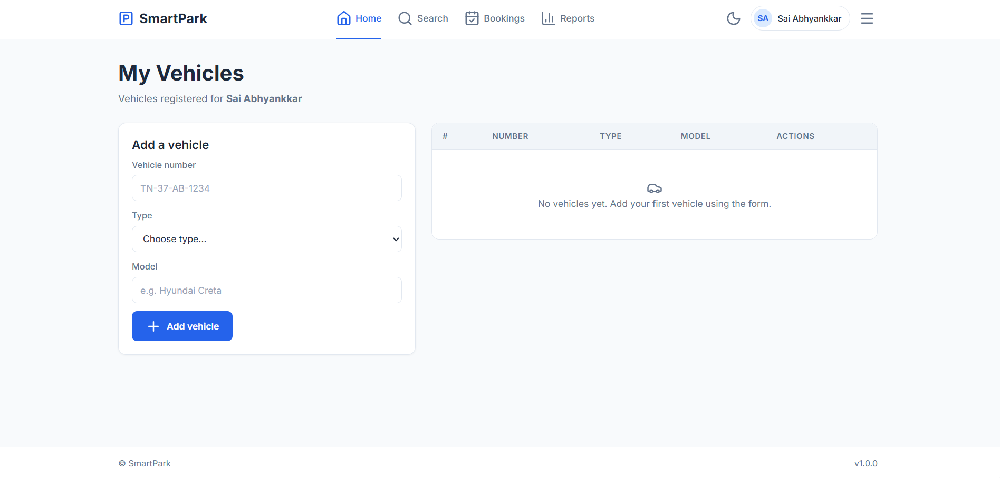
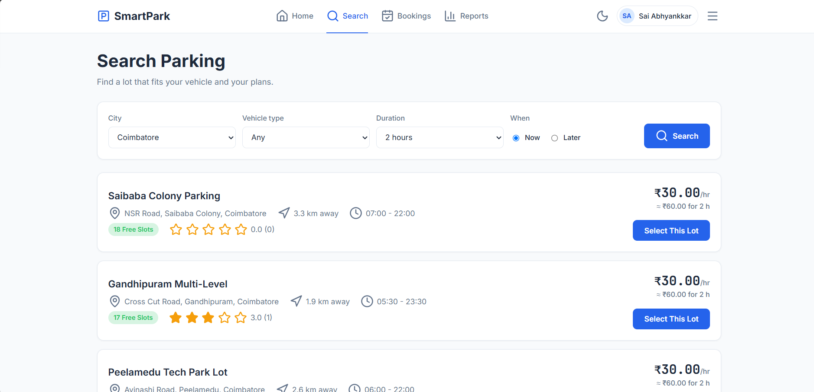
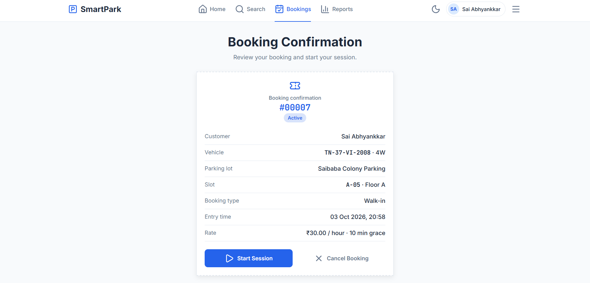
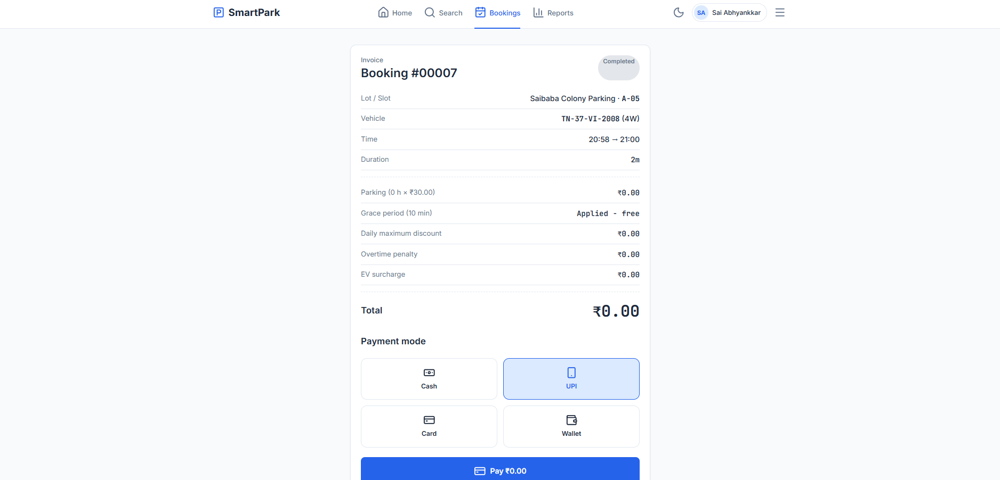
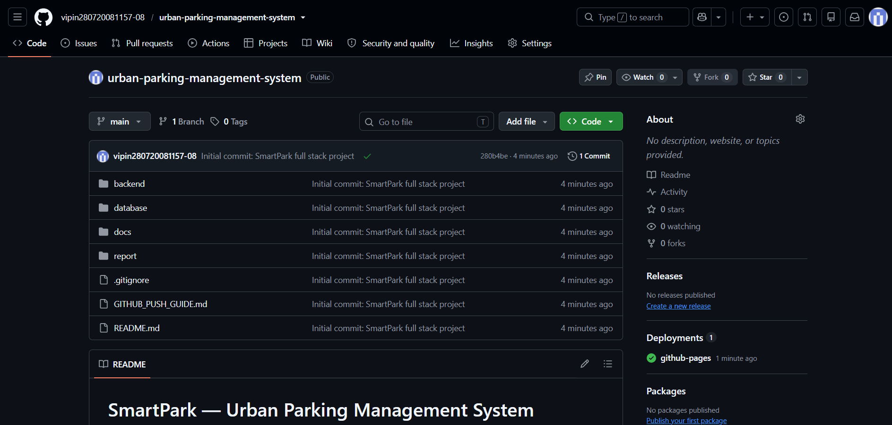

## PROBLEM TITLE:

SmartPark — Urban Parking Management System: a GUI-based database application for managing parking lots, slots, bookings, and payments.

---

## PROBLEM STATEMENT:

Parking in busy city areas is a daily struggle. Drivers circle around streets and lots looking for a free slot, with no way of knowing in advance where space is available. Many lots still depend on paper registers, so entries are lost or duplicated, the same slot can be given to two vehicles, bills are calculated by hand and often contain mistakes, and operators have no clear view of peak hours, revenue or how well each lot is used.

There is a need for a simple GUI-based database application in which data is entered through forms, saved permanently in a database, and shown instantly in tables and live views on the same page, with the ability to add, view, update and delete records without refreshing the page manually.

---

## SOLUTION:

The problem is solved by developing **SmartPark**, a web-based GUI application built on a three-tier architecture: a frontend for the user interface, a backend for handling requests, and a database for permanent storage.

**Frontend (HTML, CSS, JavaScript):** Pages are built with forms at the top and live tables or cards below. JavaScript sends data to the backend with `fetch()` and redraws the page as soon as the reply arrives, so no manual refresh is needed. The interface supports light and dark themes and works on desktop and mobile.

**Backend (Python Flask + psycopg2):** Receives requests, validates the input and talks to PostgreSQL through the psycopg2 driver. It exposes a JSON REST API: POST to create, GET to read, PUT to update and DELETE to remove records. Booking and billing are performed by calling database functions, so the rules live in one place.

**Database (PostgreSQL):** The `urban_parking_db` database stores data permanently in 10 related tables (users, vehicles, parking_lots, parking_slots, staff, pricing_rules, bookings, payments, reviews and slots_log) linked by primary and foreign keys.

**CRUD operations:**

| Operation | What happens |
|-----------|--------------|
| Create | A form adds a new record (user, vehicle, booking, payment, review). |
| Read | Tables and cards list the saved records, filtered by user or lot. |
| Update | A record is loaded back into the form and the changes are saved. |
| Delete | A record is removed after confirmation. |

Every change is written to the database first and then displayed, so the screen and the database always match.

**Modules:** Dashboard, Users, Vehicles, Lots, Slots, Bookings, Payments, Staff, Pricing and Reports.

**Data integrity:** Primary and foreign keys link the tables; UNIQUE constraints prevent duplicate emails, phone numbers, vehicle numbers and slot numbers within a lot; CHECK constraints restrict vehicle types, slot status, payment modes and ratings; a trigger rejects a second active booking on the same slot; a trigger calculates the bill automatically when a booking ends and frees the slot; and a trigger records every slot status change in an audit log. Seven indexes speed up the most frequent queries, four views support the dashboard, and three stored functions handle booking, exit-and-billing and the daily report.

**Tools used:** Python, Flask, psycopg2, PostgreSQL, pgAdmin, HTML/CSS/JavaScript, Lucide icons, Chart.js, Git, GitHub and VS Code.

**Deployment modes:** The same frontend runs in two modes. On **GitHub Pages** it detects the domain and runs as a demo with built-in sample data, needing no server. On a **local machine** it calls the Flask API, which reads and writes the real PostgreSQL database.

---

## BLOCK DIAGRAM(S):

The proposed solution is shown in the block diagrams below.

### Block Diagram 1: ER Diagram

**Block Diagram 1: Entity-Relationship diagram of `urban_parking_db`.** The diagram shows the 10 entities with their keys and relationships. A user owns many vehicles and makes many bookings; every booking links one user, one vehicle and one parking slot. A parking lot contains many slots, employs staff and receives reviews, and each booking has at most one payment. The pricing rules table is used during billing, and the slots log keeps an audit trail of status changes.

### Block Diagram 2: Module Diagram

**Block Diagram 2: Module diagram of SmartPark.** The system is divided into three groups of modules. *User Modules* (User Profile, Vehicle Management, Search Parking, Booking History) serve the driver. *Core Modules* (Slot Booking, Live Session Timer, Billing & Payment, Slot Management) carry out the parking workflow. *Admin Modules* (Parking Lots & Staff, Pricing Rules, Reports & Analytics) support the operator.

---

## OUTPUT:

### Figure 1 — Dashboard (Home page)

**Figure 1: Dashboard — user selection, live statistics and module navigation.**

**Explanation:** The home page lets the user pick a name from a drop-down filled from the `users` table, or add, edit and delete users. Six live cards show the number of lots, free slots, active bookings, today's revenue, users and average rating. These values are computed by the database through aggregate queries, and the module cards below link to every other page.

### Figure 2 — Vehicles page

**Figure 2: Vehicles page — add-vehicle form and vehicle records.**

**Explanation:** The form at the left adds a vehicle with its number, type (2W, 4W or EV) and model. The saved record appears in the table at once, without a page refresh. View shows the details, Edit loads the row back into the form for updating, and Delete removes it. The vehicle number must be unique, and a vehicle that already has bookings cannot be deleted.

### Figure 3 — Search Parking page

**Figure 3: Search Parking — filters and matching parking lots.**

**Explanation:** The user filters by city, vehicle type, duration and Now/Later. For each lot the page shows the number of free slots of the selected type, the hourly rate from `pricing_rules`, an estimated cost for the chosen duration, the average rating from `reviews` and an approximate distance. Selecting a lot opens its slot map.

### Figure 4 — Slot Map page

**Figure 4: Slot Map — interactive slot grid for the chosen lot.**

**Explanation:** Every row of `parking_slots` for the lot is drawn as a coloured tile: green for available, red for occupied, amber for maintenance and blue for the selected slot. Slots that do not match the vehicle type are dimmed. A floor selector switches between floors, and a confirm bar appears when a green slot is selected. Confirming calls the `fn_book_slot` database function.

### Figure 5 — Booking Confirmation page

**Figure 5: Booking Confirmation — receipt-style booking details.**

**Explanation:** After booking, the receipt shows the booking number, customer, vehicle, lot, slot, entry time and pricing. Behind the scenes the function has checked that the slot is free, inserted the booking and marked the slot as occupied in one transaction, while a trigger blocks any second active booking on the same slot. Start Session opens the live timer and Cancel Booking releases the slot.

### Figure 6 — Live Session page

**Figure 6: Live Session — running timer and estimated bill.**

**Explanation:** A large HH:MM:SS timer counts from the booking's entry time and an estimated bill is refreshed every 10 seconds using the same pricing rules as the database. Extend Time lengthens the planned stay. Exit & Pay calls `fn_exit_and_bill`, which stores the exit time and marks the booking as completed.

### Figure 7 — Bill & Payment page

**Figure 7: Bill & Payment — itemised invoice and payment mode.**

**Explanation:** The invoice lists the duration, parking charge, grace period, daily-maximum discount, overtime and EV surcharge. The total was calculated automatically by a trigger when the booking was completed, and the same trigger set the slot back to available. Choosing Cash, UPI, Card or Wallet and pressing Pay creates the payment record, linked to the booking by a unique key.

### Figure 8 — My History page

**Figure 8: My History — past bookings, summary and reviews.**

**Explanation:** Summary cards show total bookings, total spent, total parked time and the favourite lot. The table below lists each booking with date, lot, slot, duration, amount, status and payment state. Completed bookings link to the bill, and the Rate a Lot button opens a form with star rating and comment that is saved in the `reviews` table and updates the lot's average rating.

### Figure 9 — Admin Reports page

**Figure 9: Admin Reports — KPIs, charts and top users.**

**Explanation:** Four KPI cards show today's revenue, total bookings, average duration and pending payments. Four charts show revenue per lot, peak hours, vehicle-type split and slot utilization, each fed by an analytical SQL query or view. A table lists the top five users by spending. The charts redraw with new colours when the theme is switched.

---

## GITHUB:

Repository: https://github.com/vipin280720081157-08/urban-parking-management-system

---

## OUTCOME:

The project successfully demonstrates a complete GUI-based database application. Users enter data through forms, the backend validates it and stores it in PostgreSQL, and the saved records appear at once on the page. Users, vehicles, bookings, payments and reviews can be created, viewed, updated and deleted, and every change is reflected in both the interface and the database without a manual refresh. Bills are calculated automatically by database triggers, a live session timer tracks each stay, and an analytics dashboard summarises revenue and usage. The application runs both as a hosted demo with sample data and locally with a real database.

---

## Key Outcomes:

1. Successfully developed a GUI-based database application using Flask, JavaScript and PostgreSQL.
2. Implemented all four CRUD operations for users, vehicles, lots, slots, bookings, payments and reviews.
3. The table updates instantly after every change, with no manual page refresh.
4. Database triggers and constraints prevent double booking, duplicate slots and invalid deletions.
5. Automatic bill calculation, live session timer and analytics dashboard reduce manual work.
6. Demonstrates three-tier architecture with dual deployment (mock demo on Pages + real DB locally).
